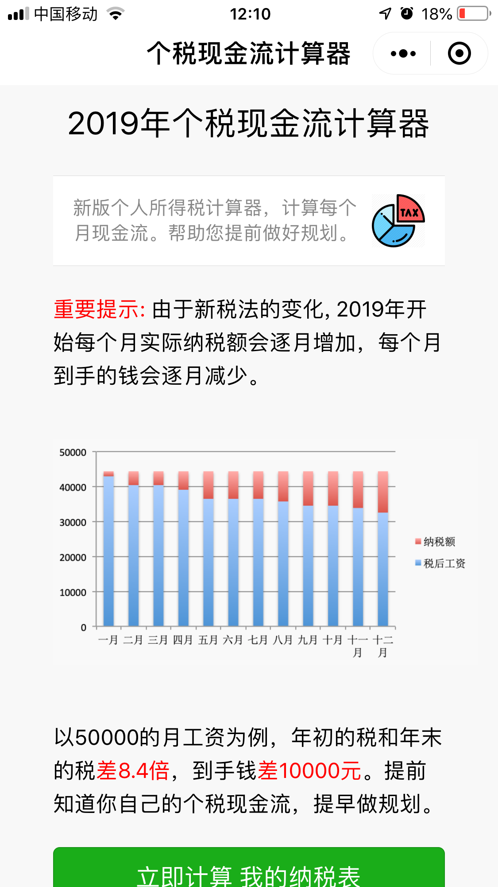

# TaxCalc - 个税现金流计算器

TaxCalc 个税现金流计算器 的 微信小程序。

### 背景介绍

易用的个人现金流计算器，帮助你了解每个月收入，管理全年现金流。

2019年颁布了新税法，改成 “累计预扣预缴”，造成的结果是每个月实际到手收入会持续下降。本个税现金流计算器可以计算全年现金流情况。

### 小程序界面




> 欢迎页面


> 输入页面


> 结果页面


### 配置

编辑project.config.json，把appid替换成你自己在微信小程序的appid，然后在微信开发工具中打开编译即可。

```javascript
  "appid": "wx1234567890",
  "description": "项目配置文件",
```

### 扫码试用

这是小程序码，欢迎扫码试用。


### 关于作者

Adam429 Lee (adam429.lee@gmail.com). 

如果你觉得这个应用好，可以扫描付费版向作者支付费用。或者帮忙传播物料


> 付费版宣传
